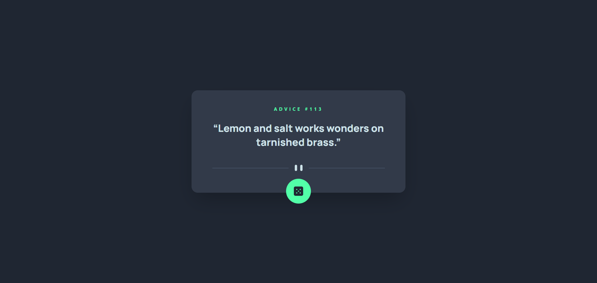

# Frontend Mentor - Advice generator app solution

This is a solution to the [Advice generator app challenge on Frontend Mentor](https://www.frontendmentor.io/challenges/advice-generator-app-QdUG-13db). Frontend Mentor challenges help you improve your coding skills by building realistic projects.

## Table of contents

- [Overview](#overview)
  - [The challenge](#the-challenge)
  - [Screenshot](#screenshot)
  - [Links](#links)
- [My process](#my-process)
  - [Built with](#built-with)
  - [What I learned](#what-i-learned)
  - [Continued development](#continued-development)
  - [AI Collaboration](#ai-collaboration)
- [Author](#author)

## Overview

### The challenge

Users should be able to:

- View the optimal layout for the app depending on their device's screen size
- See hover and active states for all interactive elements on the page
- Generate a new piece of advice by clicking the dice icon

### Screenshot



### Links

- Solution URL: [GitHub Repository](https://github.com/Ismaellerakotoson/advice-generator-app.git)
- Live Site URL: [Live Demo](https://ismaellerakotoson.github.io/advice-generator-app)

## My process

### Built with

- Semantic HTML5 markup
- [React](https://react.dev/) with TypeScript
- [Vite](https://vitejs.dev/) - Build tool
- [Tailwind CSS](https://tailwindcss.com/) - For styles
- Custom React hook for data fetching
- [Advice Slip API](https://api.adviceslip.com/) - Random advice data
- Mobile-first workflow

### What I learned

This was my first project written entirely in TypeScript by hand, without relying on AI to write the typed code for me. The main goal was to actually understand what each type was doing rather than copy-pasting.

A key takeaway was understanding the difference between describing a raw API response and the shape of data I actually want to keep in state:

```ts
interface AdviceSlip {
  id: number;
  advice: string;
}

interface AdviceResponse {
  slip: AdviceSlip;
}
```

`AdviceResponse` only exists to describe what the API sends back; I extract `data.slip` and store only `AdviceSlip` in state, which keeps the rest of the app simpler to type.

I also ran into a subtle bug where clicking the dice button sometimes didn't update the advice until a second click. This turned out to be the browser caching the `fetch` response rather than a logic error:

```ts
const response = await fetch('https://api.adviceslip.com/advice', {
  cache: 'no-store',
});
```

Finally, I practiced separating concerns between a custom hook (`useAdvice`, which owns state and fetching logic) and presentational components (`AdviceCard`, `DiceButton`), each with their own typed props interface.

### Continued development

- Get more comfortable with TypeScript generics beyond `useState<T>`
- Practice writing types without relying on AI suggestions, to build true muscle memory
- Explore stricter API response validation (e.g. with Zod) instead of trusting `response.json()` blindly

### AI Collaboration

I used Claude to learn TypeScript fundamentals through guided, step-by-step questions rather than getting full code written for me. For each part of the app (types, custom hook, component props), I was asked to attempt the code first, and Claude reviewed it, pointed out mistakes, and explained the reasoning before I corrected them myself. This helped me actually understand concepts like typing `useState`, interface design, and the difference between a hook and a component, instead of just copying working code.

## Author

- Frontend Mentor - [@Ismaellerakotoson](https://www.frontendmentor.io/profile/Ismaellerakotoson)
- GitHub - [@Ismaellerakotoson](https://github.com/Ismaellerakotoson)